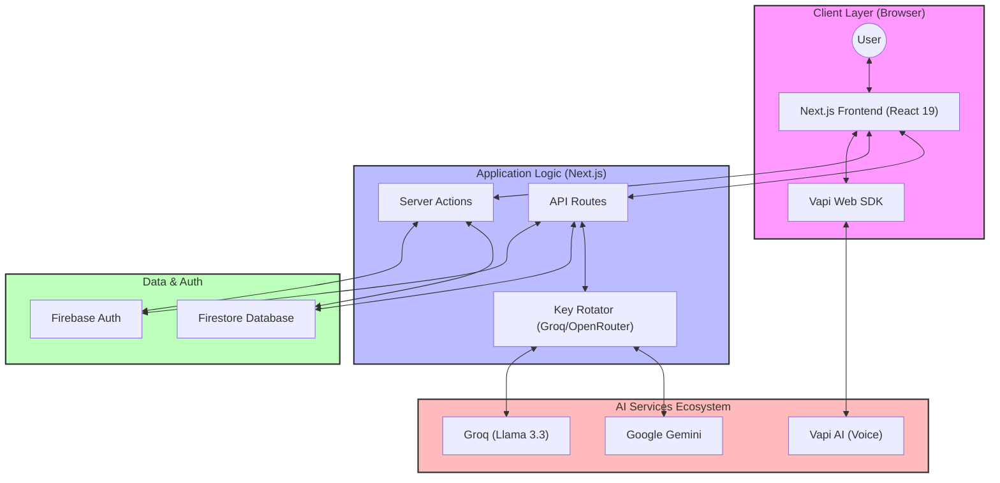

# AI MEET — System & Technical Architecture

This document provides a comprehensive overview of the architecture and technical design of **AI MEET**, an AI-powered mock interview platform.

---

## 1. System Architecture

The AI MEET system is built on a modern, event-driven, and serverless architecture. It leverages multiple specialized AI providers to deliver a seamless, real-time interview experience.

### 1.1 High-Level Overview



### 1.2 Core Modules

- **Authentication Module**: Manages user sessions using Firebase Authentication (Email/Password).
- **Interview Engine**: Orchestrates real-time voice interactions via Vapi AI. It handles the state transition from setup to live interview to feedback.
- **Feedback System**: A specialized pipeline that takes interview transcripts and uses LLMs (Gemini/Groq) to provide structured scoring across communication, technical, and behavioral metrics.
- **Prep Hub**: A RAG-inspired (Retrieval Augmented Generation) module that parses uploaded resumes (PDF/Docx) and generates tailored Q&A and profile improvements.
- **Quiz & Analytics**: Interactive module that generates dynamic MCQs and tracks progress using visual charts.

---

## 2. Technical Architecture

### 2.1 Technology Stack

| Layer | Technology | Rationale |
| :--- | :--- | :--- |
| **Framework** | Next.js 15.5 | App Router for better SEO, Server Components for performance, and Turbopack for fast dev cycles. |
| **Logic** | TypeScript 5 | Strong typing to ensure code reliability across complex AI data structures. |
| **State Management** | React Hooks + Firestore | Real-time synchronization for user data and interview history. |
| **Styling** | Tailwind CSS 4 + Shadcn UI | Rapid UI development with highly accessible and customizable components. |
| **Voice Interface** | Vapi AI | Managed infrastructure for low-latency, full-duplex voice conversations. |
| **LLM Processing** | Groq + Gemini | Groq (Llama 3.3) for ultra-fast chat/analysis; Gemini for comprehensive structured feedback. |
| **Database/Auth** | Firebase | Serverless, real-time database and secure authentication with minimal overhead. |

### 2.2 Data Flow & Integration Diagram

This diagram illustrates the sequence of operations during a core interview-to-feedback cycle.

```mermaid
sequenceDiagram
    participant U as User
    participant F as Frontend (React)
    participant V as Vapi AI (Cloud)
    participant B as Backend (API/Actions)
    participant DB as Firestore
    participant LLM as Groq/Gemini

    U->>F: Start Interview
    F->>B: Initialize Session
    B->>DB: Create Entry (Status: Pending)
    B-->>F: Session Token
    F->>V: Connect Voice (Web SDK)
    U<->>V: Real-time Conversation
    V->>B: Webhook: Call Ended (Transcript)
    B->>DB: Save Transcript
    B->>LLM: Analyze Transcript (Prompting)
    LLM-->>B: Structured Feedback (JSON)
    B->>DB: Update Entry (Status: Completed)
    F->>DB: Listener: Fetch Results
    F->>U: Display Feedback & Analytics
```

### 2.3 Technology Stack

The system uses a flexible NoSQL schema in Firestore:

- **`users/`**: Stores basic profile info, tech stack preferences, and aggregated stats.
- **`interviews/`**: 
    - `id`: Unique interview ID.
    - `userId`: Reference to the user.
    - `type`: Technical, Behavioral, etc.
    - `status`: Scheduled, Completed, Draft.
    - `transcript`: Array of message objects (Role/Content).
    - `feedback`: Structured JSON (Scores, Strengths, Improvements).
- **`quizzes/`**: 
    - `id`: Unique quiz ID.
    - `userId`: Reference to the user.
    - `topic`: JavaScript, DSA, etc.
    - `score`: Detailed breakdown of results.
- **`contact/`**: Stores support and contact form submissions.

### 2.3 API Integration & Security

#### API Key Rotation Strategy
To mitigate rate limits (especially with Groq), the platform implements a `KeyRotator` service.
- **Location**: `lib/key-rotator.ts`
- **Logic**: Uses a Round-Robin algorithm to cycle through multiple API keys provided via environment variables.

#### Webhook Handling
The platform listens to Vapi webhooks (`/api/vapi`) to:
1. Detect when a call starts/ends.
2. Receive the final transcript.
3. Automatically trigger the feedback generation pipeline upon completion.

#### Security Implementation
- **Server-Side Validation**: All forms are validated using **Zod** and **React Hook Form**.
- **Protected Routes**: Middleware and Server Components check for valid Firebase tokens before rendering private sections (Profile, Interview, etc.).
- **Firebase Admin**: Used for sensitive operations that shouldn't happen on the client side (e.g., initial user data creation, batch exports).

### 2.4 Infrastructure & Performance

- **Deployment**: Configured for **Netlify** with `@netlify/plugin-nextjs`.
- **Media Parsing**: Uses `pdf-parse-fork` and `mammoth` for server-side file extraction to prevent client-side heavy lifting.
- **Static Content**: Company question banks and category data are stored as JSON files for sub-millisecond access and reduced database costs.

---

## 3. Design Principles

1. **AI-First UX**: Prioritize low friction for AI interactions (voice, chat, analysis).
2. **Modular Components**: Reusable UI components (FormFields, Cards, etc.) for consistency.
3. **Responsive Design**: Mobile-first approach using Tailwind's utility classes.
4. **Performance**: Leveraging Next.js Server Components to reduce the JavaScript bundle size on the client.
